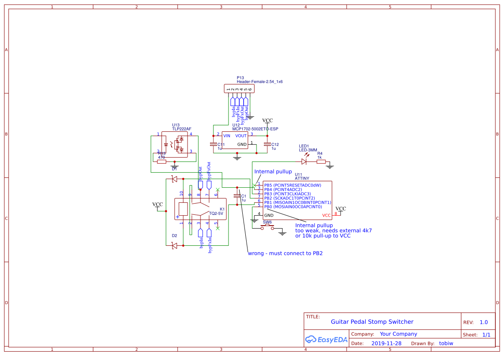
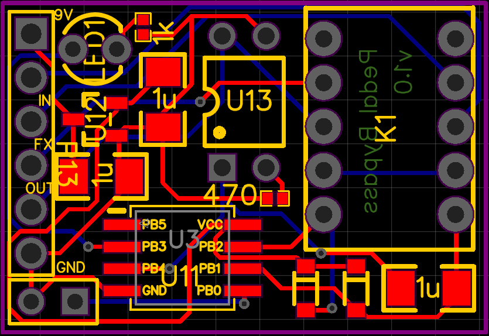

Guitar Pedal Effects Stomp Switcher
-----------------------------------

Version 1.0
===============
Known issues:

- using the internal ATtiny pull-up resistor for switch input is too weak, possibly due to interference from relay switching
- C1 should be connecting PB1 and PB2

Schematic:

Board layout:

